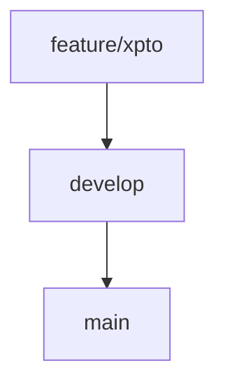
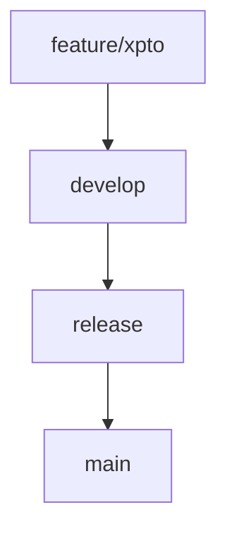

# 🚀 Trade Arena - Fluxo de Branches (GitFlow Simplificado)

## 📌 Branches principais
- `main`: Branch de **produção**. Código testado, validado e pronto para deploy.
- `develop`: Branch de **desenvolvimento**. Tudo que estiver em desenvolvimento e precisa de testes entra aqui.

## 📌 Branches de funcionalidade
Toda nova feature, correção ou melhoria deve ser desenvolvida em uma branch separada:

### 🟢 Exemplo de nomenclatura:
| Tipo      | Padrão                         | Exemplo                           |
|----------|-----------------------------------|-----------------------------------|
| Feature  | feature/nome-da-feature           | feature/cadastro-usuario          |
| Fix      | fix/descricao-bug                 | fix/corrige-validacao-email       |
---

## 📌 Fluxo de desenvolvimento


1. Criar a branch a partir da `develop`:
```bash
git checkout develop
git checkout -b feature/nome-da-feature
```

2. Após finalizar a task, subir para o repositório e abrir o Pull Request **para a develop**
```bash
git push origin feature/nome-da-feature
```

3. Realizar os testes necessários.

4. Quando validado, realizar o merge da `develop` na `main` para publicação em produção.

---

## 📌 Futuro - Implementação da `release`
- A branch `release` será criada para homologar funcionalidades antes da `main`.


---

## 📌 Padrão de Commits
Utilizar convenções de mensagens para commits:
```
feat: descrição da nova funcionalidade
fix: descrição da correção de bug
refactor: descrição da refatoração
```

---

## 📌 Regras Gerais
- Nunca realizar `push` diretamente na `main`
- Sempre trabalhar com `Pull Request`
- Validar o código antes de fazer merge na `main`
- Manter o padrão de nomenclatura e commits

---

## 👾 Exemplo de comandos para iniciar uma feature:
```bash
git checkout develop
git checkout -b feature/cadastro-usuario
git add .
git commit -m "feat: cria endpoint de cadastro de usuário"
git push origin feature/cadastro-usuario
```

---

# 🚀 Bora padronizar e escalar! 
Dúvidas? Chama o time técnico!
